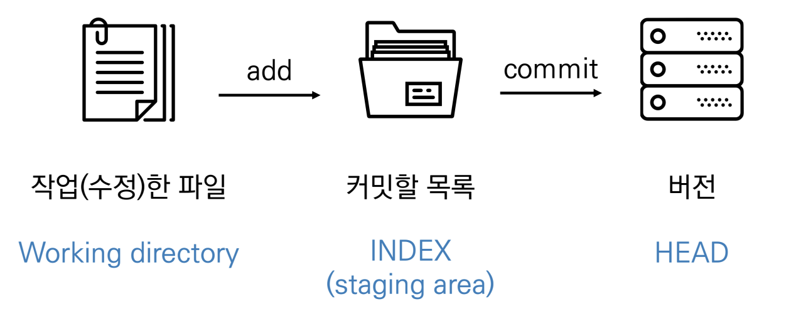
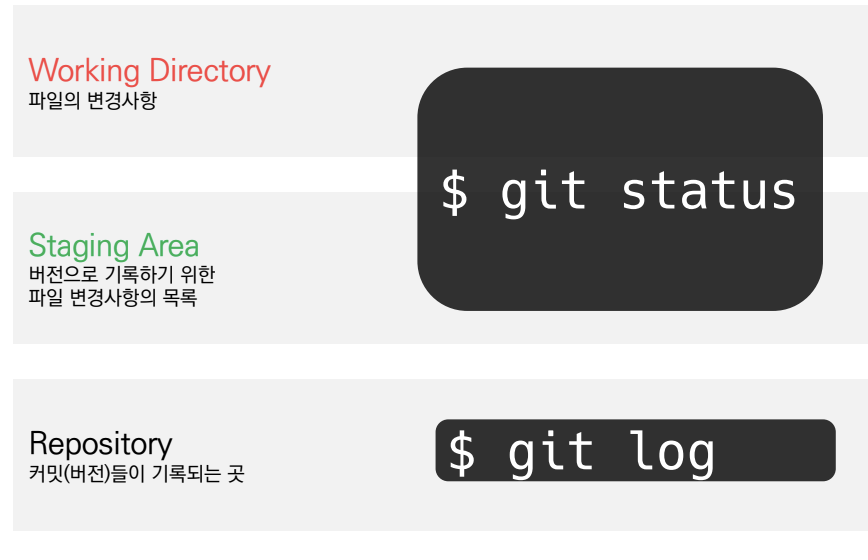
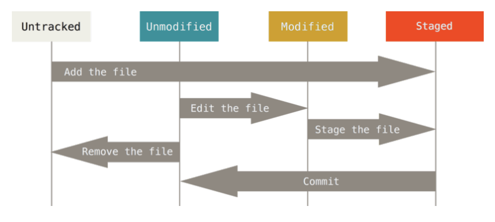

# CLI (Command Line Iterface)
- 명령어 기반 인터페이스, 가상 터미널을 통해 사용자와 컴퓨터가 상호 작용하는 방식
- 작업 명령은 사용자가 문자열의 형태로 입력하고, 컴퓨터로부터의 출력 또한 문자열의 형태이다.
- GUI : 그래픽 기반의 인터페이스
  
</br>

# 디렉토리 관리
- pwd(print working directory) : 현재 디렉토리 출력
- cd 디렉토리 이름(change directory) : 디렉토리 이동
  - . : 현재 디렉토리 
  - .. : 상위 디렉토리
- ls(list) : 목록
- mkdir(make directory) : 디렉토리 생성
- touch : 파일 생성
- rm 파일명 : 파일 삭제하기
  - rm -r 폴더명 : 폴더 삭제하기

</br>

# Git 
- Git은 분산 버전 관리 시스템(DVCS)으로 `코드의 버전을 관리하는 도구`
- 2005년 리누스 토르발스가 개발함
- 컴퓨터 파일의 변경사항을 `추적`하고, 여러명의 사용자들 간에 해당 파일들의 작업을 `조율`
- `Git은 버전(커밋)을 관리한다`
- `GitHub도 버전(커밋)을 관리한다`

</br>

# 분산버전관리시스템(DVCS)
- 중앙집중식버전관리시스템 : 중앙에서 버전을 관리하고 파일을 받아서 사용
- `분산버전관리시스템` : 원격 저장소(remote repository)를 통하여 협업하고, 모든 히스토리를 클라이언트들이 공유

</br>

# 원격저장소 (Remote Repository)
- 네트워크를 활용한 저장소
  - github, gitlab, bitbucket
- 로컬 저장소의 버전을 원격저장소로 보낸다. `$ git push`
- 원격 저장소의 버전(커밋)을 로컬 저장소로 가져온다. `$ git pull`


</br>

# Git 버전 관리 흐름
- git은 파일을 modified, staged, committed로 관리
  - modified : 파일이 수정된 상태
  - staged : 수정한 파일을 곧 커밋할 것이라고 표시한 상태
  - committed : 커밋이 된 상태

```
working directory(파일의 변경사항) 
→ staging area(버전으로 기록하기 위한 파일 변경사항의 목록) 
→ .git directory
```

</br>

# 버전 관리
- 버전 : 컴퓨터 소프트웨어의 특정 상태
- 버전 관리를 해주는 건   `Git`
- 버전관리 , 소스코드 관리란 ?  동일한 정보에 대한 여러 버전을 관리하는 것을 말한다.
- 과거의 파일을 보존하면서 현재 파일과의 차이와 수정이유를 메시지를 남길 수 있다. 
- 복원도 가능함

</br>

# git 파일 생성 방법
1. mkdir "폴더명" : 폴더 생성
2. touch "파일명" : 파일 생성

</br>

# git init 
- 로컬에서 새로운 프로젝트 시작 
- 특정 폴더를 git 저장소를 만들어 git으로 관리함
   - terminal에 git init 입력 후
   - 'Initialized empty git repository in 경로'가 출력되는지 확인

</br>

# 버전 기록 흐름

1. 작업(수정)한 파일을(working directory)
   → `$ git add 파일`을 입력하고
    - untracked → staged
    - modified → staged
2. add하여 staging area에 모아
   → `$ git commit` 입력
    - ` $ git commit -m '커밋 메시지' `입력 (변경 사항을 나타낼 수 있도록 명확하게 작성해야 함)
3. Repository에 커밋(버전)으로 남긴다 (=commit)

</br>

# 현재 상태를 어떻게 알 수 있을까?


- `$ git status`
  - git 저장소에 있는 파일의 상태를 확인하기 위하여 활용
  - Status로 확인할 수 있는 파일의 상태
    - Tracked : 이전부터 버전으로 관리되고 있는 파일
      - Unmodified : git status에 나타나지 않음
      - Modified : Changes not staged for commit
      - Staged : Changes to be committed
    - Untracked : 버전으로 관리된 적 없는 파일 (파일을 새로 만든 경우)
 
- `$ git log`
  - 현재 저장소에 기록된 커밋을 조회
  - 다양한 옵션을 통해 로그를 조회할 수 있음
    - $ git log - 1
    - $ git log --oneline
    - $ git log -2 --oneline
  
- Nothing to commit, working tree clean : 더이상 진행할 커밋 없음

</br>

# 파일 라이프사이클


</br>

# git 기초 명령어

|명령어|내용|
|------|---|
|git init|로컬 저장소 생성|
|git add 파일명|특정 파일/폴더의 변경사항 추가|
|git commit -m '커밋메시지'|커밋(버전 기록)|
|git status|상태 확인|
|git log|버전 확인|

</br>

# Git 설정 파일 (config)
- 사용자 정보(commit author) : 커밋을 하기 위해 반드시 필요
- 깃허브에서 설정한 username과 email로 설정
  
  ```
  git config --global user.name "username" 
  git config --global user.email "useremail"
  ```
- 설정 확인
  - git config - l
  - git config - global -l
  - git config user.name

- --system
  - /etc/gitconfig
  - 시스템의 모든 사용자와 모든 저장소에 적용(관리자 권한)

- --global
  - ~/.gitconfig
  - 현재 사용자에게 적용되는 설정

- --local
  - .git/config
  - 특정 저장소에만 적용되는 설정

</br>

# 총정리
(1) $ git config

  : git 설치시 가장 먼저해야 하는 것
```
$ git config --global user.name “유저네임”
$ git config --global user.email "이메일주소"
```
(2) $ git init

  : 로컬 저장소로 사용할 폴더를 만들기
```
$ git init
```
(3) $ git add

  : 로컬 저장소에 파일 추가
```
$ git add 파일명
```
(4) $ git commit 

  : staged 상태의 파일을 커밋하기 / 로컬 저장소에 저장됨
```
$ git commit -m '메시지 남기기'
```
(5) $ git reomte
```
$ git remote add origin (url주소)
 → remote 입력 확인 : $ git remote -v
 → origin (url 주소) (fetch)
 → origin (url 주소) (push)
 ```
(6) $ git push
```
$ git push origin master
```