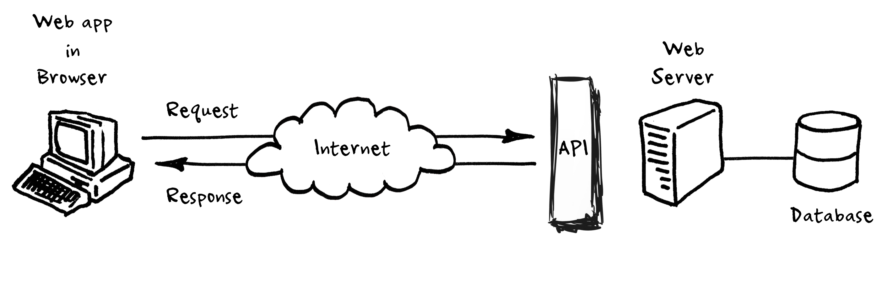

# 컴퓨터 구성요소
- CPU(중앙처리장치) : 컴퓨터의 머리, 가장 빠름, 저장X
- RAM(메모리) : CPU의 작업공간, 저장X
- HCC,SDD(보조기억장치) : 느림, 저장된 자료 보관
```
CPU가 RAM에서 작업하고
보조기억장치에서 작업물을 저장한다.
```

</br>

# 운영체제(Operating System)
- 운영체제 위에서 IDE 코드편집기를 이용해 프로그래밍 언어로 코드를 짜는데 이 코드들은 컴파일러 또는 인터프리터라고 하는 프로그램이 번역을 해서 프로그램을 만든다.
- 운영체제 종류 : Windows, Mac os, ios, Android, Linux ...

  ## Linux
  - 리눅스는 운영체제 종류 중 하나
  - 리눅스는 우리 대신 하드웨어를 케어 해 주면서 그 위에 어떤 프로그램을 설치해서 돌릴 수 있게 만들어주는 Windows, Mac os, ios, Android와 같은 것
  - 리눅스는 무료 OS이기 때문에 많은 버전을 가지고 있는데 그 중 Ubuntu, Red hat이 있다

</br>

# 네트워크(Network)
- LAN(Local Area Network): 선으로 컴퓨터를 연결
- MAN(Metropolitan Area Network): LAN을 연결시켜 도시를 연결시킴
- WAN(Wide Area Network): 도시와 도시, 세계를 연결
- IP 주소 : 위치에 따른 고유한 숫자 주소
- 인터넷 : 모든 컴퓨터들이 연결되어 있는 네트워크 망
  


</br>

# Front-End(client)
- 사용자가 웹사이트 또는 웹 애플리케이션, 모바일 애플리케이션을 통해 보는 인터페이스를 프론트엔드라고 부름
- 언어 : HTML, CSS, JS

</br>

# Back-End(Server)
- 웹 사이트, 웹 애플리케이션, 모바일 애플리케이션과 관련된 서버 측과 데이터베이스를 관리해 주는 테그놀로지
- 언어 : PHP, Node js, JS, C++, JAVA, Python

</br>

## Cloud
- 인터넷 통신망 어딘가에서 구름에 싸여 보이지 않는 `컴퓨팅 자원(CPU, 메모리, 디스크 등)을 원하는 대로` 가져다 쓸 수 있는 서비스
- 서버를 직접 구매할 때 고려해야 할 전력, 위치, 서버 세팅, 확장성을 고민하지 않고 서비스 운영에만 집중할 수 있음


## API 
- Application Programming Interface
- 여러 프로그램들과 데이터베이스, 그리고 기능들의 상호 통신 방법을 규정하고 도와주는 매개체
- API는 데이터베이스가 아니지만, 엑세스 권한이 있는 앱의 권한 규정과 `서비스 요청`에 따라 데이터나 서비스 기능을 제공하는 메신저 역할을 함



> Request

  - Create(올려줘) → POST
  - Read(불러와줘) → GET
  - Update(바꿔줘)→ PUT(전체)/PATCH(일부)
  - Delete(지워줘) → DELETE
  
> Response
- 요청과 응답을 주고 받을 때의 형식
   - JSON
   - XML
   - HTML 

</br>

# Framework
- 뼈대, 기반구조
- 소프트웨어의 특정 문제를 해결하기 위해서 상호 협력하는 클래스와 인터페이스의 집합
- 개발을 할 때 주도권이 코드에 있다면 `프레임워크`

</br>

# Library
- 단순 활용가능한 도구들의 집합
- 개발자가 만든 클래스에서 호출에서 사용
- 클래스들의 나열로 필요한 클래스를 불러서 사용하는 방식을 취하고 있음
- 개발을 할 때 주도권이 나한테 있다면 `라이브러리`

</br>


> 쉽게 말해서 프레임워크와 라이브러리는 개발자들이 개발을 편리하게 할 수 있도록 이미 만들어진 소스코드들의 뭉터기!

</br>

# Database(DB)
- 데이터의 저장소
- DBMS 
  - Database Management System
  -  다수의 사용자들이 데이터베이스 내의 데이터를 접근할 수 있도록 소프트웨어 도구의 집합
- RDB
  - relational database
  - 현재 가장 많이 사용되고 있는 데이터베이스의 한 종류
  - 테이블로 이루어져 있으며, 이 테이블은 키와 값의 관계를 나타냄
- RDMBS
  - Relational Database Management System
  - 관계형 데이터베이스를 생성, 갱신, 관리하기 위한 시스템
  - 레코드 단위로 데이터 읽기/쓰기가 이루어짐
  - 클라이언트가 요청을 보내면 서버가 처리해주는 C/S구조로 되어 있는데 이때 클라이언트가 요청을 보낼 때 주로 사용하는 언어가 SQL이다.
  - RDBMS종류: Oracle DB, MySQL, Maria DB, PostgreSQL, SQL Server, SQLite
- SQL
  - Structured Query Language
  - 데이터베이스에서 데이터를 정의, 조작, 제어하기 위해 사용하는 언어

</br>


